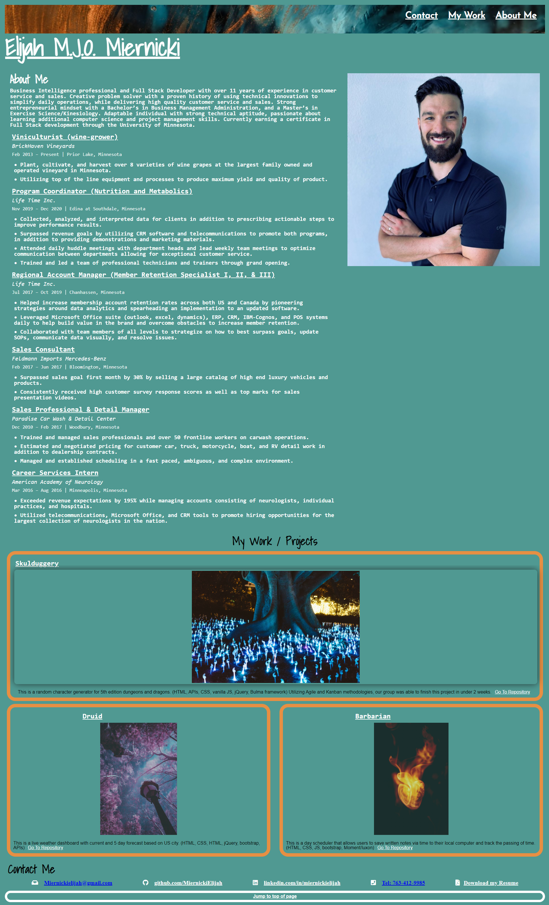

# <Bard>
## Description
  
This is a splash page about myself that allows employers and clients to view a short bio, projects, and contact information.
I designed this HTML to make it simple and clean, as well as easy for people to get in touch with me and stay up to date on my projects. 
I've learned a lot of front-end fundementals while building this page. Mainly in flexbox, HTML semantics/tags, and CSS properties. 

    
    
## Credits
#https://css-tricks.com/snippets/css/a-guide-to-flexbox/
#https://developer.mozilla.org/en-US/
#https://www.w3schools.com/
